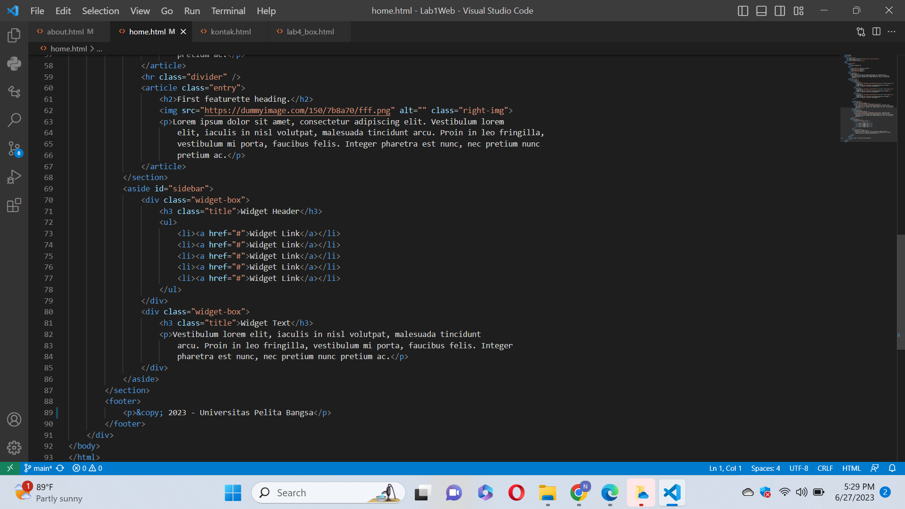

# Web1

# Praktikum 1 - Pemrograman Web (CSS Layout)

### Nurul Fajri - 312110506

### TI.21.C.1

## Langkah 1
Ini adalah Halaman HOME '
'

Ini Code nya '
'

Ini adalah halaman Artikel '
'

Ini adalah Code nya '
'

Ini adalah halaman About '
'

Ini adalah Code nya '
'

Ini adalah halaman Kontak'
'

